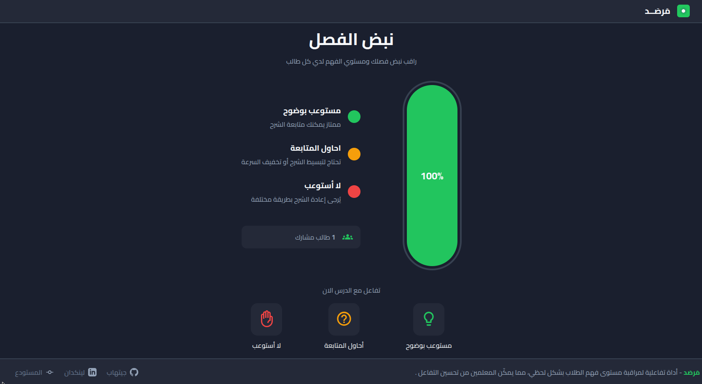

#  Marsad 


 An interactive real-time platform for monitoring student understanding during online lessons. Marsad enables teachers to track comprehension levels instantly using WebSocket technology for immediate feedback and visual analytics.

##  Screenshots



##  Features

- **Real-time Updates** - Instant feedback using WebSocket connections
- **Visual Analytics** - Live bar chart showing student understanding levels
- **Three-level System**:
  - 🟢 **Green** - Understanding clearly
  - 🟡 **Yellow** - Trying to follow
  - 🔴 **Red** - Not understanding
- **Persistent Client IDs** - Cookie-based identification
- **Responsive Design** - Works on desktop and mobile devices

## ️ Tech Stack
used the most lightweight possible tech stack to keep it simple and efficient:

- **Backend**: Node.js with native HTTP server
- **WebSocket**: `ws` library for real-time communication
- **Frontend**: Vanilla JavaScript with CSS
- **Styling**: Custom CSS with design system

##  Prerequisites

- Node.js (v18.x or higher)
- npm package manager
- Modern web browser with WebSocket support

##  Quick Start

### 1. Clone the Repository

```bash
git clone https://github.com/zerobors/Marsad.git
cd Marsad
```

### 2. Install Dependencies

```bash
npm install
```

### 3. Configure Environment Variables

Create a `.env` file in the root directory:

```bash
cp env.example .env
```

Edit `.env` and set your server URL:

```env
SERVERURL=ws://localhost:8080
```

### 4. Run Locally

```bash
npm start
```

The server will start on `http://localhost:8080`

Open your browser and navigate to:
```
http://localhost:8080
```

##  Deploy Live

To share your local server with others students, you can use **localtunnel** to create a public URL.


```bash
# Install localtunnel globally
npm install -g localtunnel

# Start your server first
npm start

# In another terminal, create a tunnel
lt --port 8080 --subdomain marsad-demo
```

You'll get a URL like: `https://marsad-demo.loca.lt`

Update `.env` with `SERVERURL=https://marsad-demo.loca.lt` and restart.

And that's it! You can now share the public URL with your students to monitor their understanding in real-time.

## Contributing
Contributions are welcome! Please open issues and submit pull requests for improvements or bug fixes.

